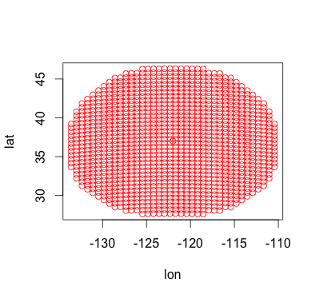
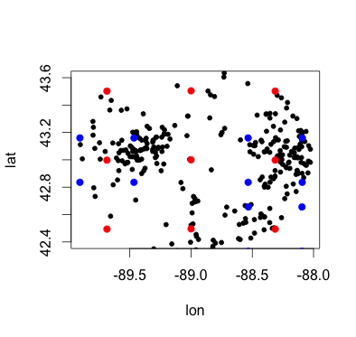

```{r, echo = FALSE}
library(wundr)
```

Package **wundr** provides API interfaces to Personal Weather Station (PWS) data 
maintained by Weather Underground (wunderground.com). Tables of PWS
locations and metadata for user specified geographic areas are constructed.
Robust retrieval of current and historical weather condition data for
selected PWS. Computational tools for spatial analysis, including Kriging
(Gaussian processes) for interpolation, as well as prediction of missing
data and forecasts. Visualization of microclimate data methods including
contextual static and interactive web maps. Additional facility to export data 
to CartoDB's spatial database hosting and webmap publishing platform.

Package **wundr** has the following functionalities:

## Creation of S4-Class Table describing a given region's PWS 

**wundr** offers several S4 classes capturing the essence of different PWS attributes including weather history, conditions, and subquerying.  It has the advantage of elegance and utility.

```{r, fig.show='hold', warning = FALSE, message = FALSE, eval = TRUE}
str(PWS.Hist.Chicago, max.level = 2)
```

```{r, fig.show='hold', warning = FALSE, message = FALSE, eval = TRUE}
knitr::kable( head( PWS.Loc.Chicago@spatialPtDF@data[,1:7] ) )
```
## Subsettable tables based on #1

Graphicly subset PWS.class objects by drawing a poylgon around PWS points
plotted in graphics device. *Note: this is interactive, so must be run run from 
the console.*
```{r, fig.show='hold', warning = FALSE, message = FALSE, eval = FALSE}
my_subset  <-  draw_subset(PWS.Conds.Chicago)
```


## Web retrieval of data and storage in memory

The interface to the Weather Underground API system is done through the low-level API-functions (note that we use `_` in names of low-level objects and `.` in others). Those functions include `PWS_meta_query` (and its auxilliary `createCentroidTable` function), the `PWS_meta_subset` function, the `PWS_conditions` function and the `PWS_history` function. The package also includes a number of datasets to illustrate the functionality of those functions (`Rio_basemap`, `Rio_metadata`, `Rio_conditions`, `Rio_history`). The user is supposed to interact with the API-functions through the aforementioned S4 obbject which call those functions. Nonetheless, full documentation is provided.

A maior issue is caused by the limitations of the API, which only allows for search radii of maximal 40km and maximal 50 results and 10 calls per minute. `PWS_meta_query` gets the metadata on stations in a circle of given radius at a location given in terms of longitude and latitude (the corresponding S4 function deals with converting city names to coordinates). To cover larger radii the function calls `createCentroidTable` which creates a complete cover of the larger cricle by smaller circles of radius 40km. An example is shown below (left), where a circle of 1080km radius is covered by small circles of radius 40km. In tests we discovered that the API in some cases returns less results than it should, even though the maximum radius and number of results were not yet reached. To rectify this the `PWS_meta_query` issues additional calls around a given location if it detects this. This is shown below (right). Displayed in red are the centres of the small circles covering the entire region. When incomplete returns are detected, the API function issues new requests (blue dots) surrounding the corresponding centre. The positions of all weather stations retrieved are shown in black. The function also pauses to not exceed the maximum number of calls per minute. It also processes the data (remove non-ASCII characters, calculate distance to the centre, sort results by distance etc). `PWS_meta_subset` subsets a list returned from `PWS_meta_query`. The function `PWS_conditions` downloads the current weather conditions for the stations in a list returned by `PWS_meta_query`. The function `PWS_history`, downloads the weather history for the staions in a list returned by `PWS_meta_query` for a given period of time. Those functions are called by the corresponding S4 routines.





## Visualization of microclimate data

Simple plots of PWS for exploratory analysis:

```{r, fig.show='hold', warning = FALSE, message = FALSE, include = TRUE}
simple_density(PWS.Conds.Chicago, title = "Chicago PWS points over \nPWS density contour")
simple_pnts(PWS.Conds.Chicago, add = TRUE)
```

Contextual mapping of PWS for exploratory analysis:

```{r, fig.show='hold', warning = FALSE, message = FALSE, include = TRUE}
basemap <- set_basemap(PWS.Conds.Chicago, zoom = 12)
gg_points(PWS.Conds.Chicago, basemap, title = "Downtown Chicago PWS")
```


## Computational tools for temporal and spatial analysis

The package includes a number of computational facilities, which are devided in temporal and spatial analysis. We first discuss the **temporal analysis** using time series techniques. The functions discussed below take as inputs data.frames with historical weather data as obtained through `PWS.History` or the underlying low-level API function `PWS_history`. The first step is to select data from those data.frames and convert it into time series objects. Since the data obtained from the weather stations is irregular we have to use a package which supports **irregular time-series** (such as `zoo`). Our funciton `history_zoo` takes a historical data frame, subsets it to select data from a given station and a number of variables and creates a time series object of class `zoo`. Here is an example:

```{r, eval=FALSE}
hist.zoo <- history_zoo(Rio_history,"IRIODEJA53",c("hum","tempm"))
plot(hist.zoo,col='red', main = "Humidity and Temperatur")
```

The plot is shown below (left). We can also transform irregular time-series into **regular time-series**, this is done internally in the function `history_ts`, which works in teh way `history_zoo` does, but transforms the output to an object of class `ts`. Having a regular time-series is important for analysis and forecasting, since many models rely on this assumption. We provide a function `history_forecast` which fits an **exponential smoothing state space model (ETS)** and makes forecasts using this. The fitting procedure is based on the `forecast` package. The advantage of the (ETS) model is that it allows for good fits to seasonal data, as we encouter here. We can fit a model and produce a plot of the forcast with confidence intervals as follows (see right plot below).

```{r, eval=FALSE}
hist.ts <- history_ts(Rio_history,"IRIODEJA53","hum")
hist.forecast <- history_forecast(hist.ts)
plot(hist.forecast, main = 'Forecast', xlab='Time (days)', ylab='Humidity (%)')
```

```{r, fig.show='hold', echo=FALSE}
hist.zoo <- history_zoo(Rio_history,"IRIODEJA53",c("hum","tempm"))
plot(hist.zoo,col='red', main = "Humidity and Temperatur")
hist.ts <- history_ts(Rio_history,"IRIODEJA53","hum")
hist.forecast <- history_forecast(hist.ts)
plot(hist.forecast, main = 'Forecast', xlab='Time (days)', ylab='Humidity (%)')
```

The second part of the computational toolkit is **spatial analysis**. Popular models for spatial predictions and interpolations are **Gaussian Processes (GPs)**, which in spatial statistics are also known as **Kriging**. The kenerel underlying the GP induces spatial correlation between points. We can make predictions by calculating the posterior distribution over a new point. To do so we first created a function `create_geo_cond` which selects a variable from a data.frame containing weather conditions and create an object of class `geodata`  
```{r }
data.geo <- create_geo_cond(Rio_conditions,"temp_c")
```
The GP is fitted using our function `GP_fit` which itself is based on the package `geoR`. Internally, in `GP_fit` we create a grid of points to make predictions on. This is done using our function `create_grid`. A GP is then fitted and the predictions on the grid plotted as follows
```{r ,eval=FALSE}
model<-GP_fit(data.geo)
ggplot2::ggplot(data = model, ggplot2::aes(x=lon, y=lat)) +
  ggplot2::geom_tile(ggplot2::aes(fill = value),colour = "white") +
  ggplot2::scale_fill_gradient(low = "yellow", high = "red") +
  ggplot2::geom_point(data=Rio_metadata$PWSmetadata,col='black')
```

```{r ,echo=FALSE, results='hide' , warning=FALSE, comment=FALSE}
model<-GP_fit(data.geo)
ggplot2::ggplot(data = model, ggplot2::aes(x=lon, y=lat)) +
  ggplot2::geom_tile(ggplot2::aes(fill = value),colour = "white") +
  ggplot2::scale_fill_gradient(low = "yellow", high = "red") +
  ggplot2::geom_point(data=Rio_metadata$PWSmetadata,col='black')
```

Those results can then be used in more advanced visualisations. We predented a basic computational analysis toolkit. In future updates it would be intersting to include Gaussian Processes analysis for time series which is still an active field of research, as well as a combined spatio-temporal analysis using GPs with combined kernels, which could be visualised using animated spatial visualisations.


## Web interface with interactive Visuals
For explanitory purposes, the user can also create interactive web maps powered 
by leaflet.js. Here, PWS locations are plotted. Station specific data can 
also be retrieved via interactive pop-ups. (click on a station)

```{r, fig.show='hold'}
webmap_pnts(PWS.Conds.Chicago)
```

Raster images can also be sent to the interactive map. Below, a simple 
density (heatmap) of PWS locations.

```{r}
webmap_raster(PWS.Conds.Chicago)
```

## Integration with the CartoDB platform  
**wundr** also contains functions that interface with the CartoDB SQL API
(http://docs.cartodb.com/cartodb-platform/sql-api/). This allows users to exploit the robust PostGIS spatial database and web publishing services of CartoDB.  

*(note: these code chunks cannot be evaluated using knitr, but you can run from console with your own account and key)*

Here, we export Downtown Chicago Weather Underground PWS data to CartoDB's:  

```{r, eval = FALSE}
matt.cdb.key <- "f09ad502b34fa4096a62ea306b4650337d41009c"
matt.cdb.account <- "biglakedata"
pizza <- PWS.Conds.Chicago
r2cdb(matt.cdb.key, matt.cdb.account, pizza)
```
You can view this map here: https://biglakedata.cartodb.com/tables/pizza/map 

This interface goes both ways; we can also import spatial SQL tables into R data frame objects. 

```{r, eval = TRUE}
# matt_cdb_table <- get_cdb_table("condTest", matt.cdb.account)
head(matt_cdb_table$rows[ , c("cartodb_id", "station_id", "temperature_string", 
                              "dewpoint_string")],2)# pulled from presaved data file
```

