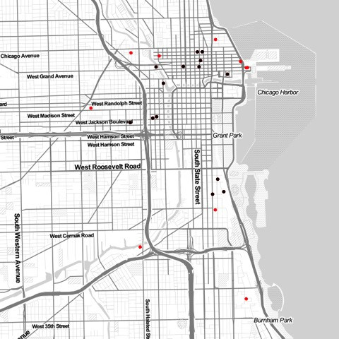

```{r, echo = FALSE}
library(wundr)
```

Package **wundr** provides API interfaces to Personal Weather Station (PWS) data 
maintained by Weather Underground (wunderground.com). **wundr** represents a robust retrieval mechanism of data and computational tools for visual and spatial analysis as well as forecasting through Gaussian Kriging. An additional facility to export data to CartoDB's spatial database hosting and webmap publishing platform is included. Package **wundr** specifically offers the following functionalities:

### Creation of S4-Class Table describing a given region's PWS 

**wundr** provides its users tables of PWS locations and metadata for user-specified geographic regions. Subsequently, weather condition and historical data may easily be retrieved for the selected PWS.  First, the user inputs her desired coordinates--or, alternatively, a character string of a name of a state or region--as well as a search radius and their wunderground API user key.  The user's input is validated to ensure that only proper longitude and latitude coordinates get entered or a proper location-based character string.
```{r, fig.show='hold', warning = FALSE, message = FALSE, eval = FALSE}
PWS.Loc.Chicago <- PWS.Locations(-87.6298, 41.87811 radius=5, user.key)
PWS.Loc.Chicago <- PWS.Locations("Chicago, IL", radius=5, user.key)
plot(PWS.Loc.Chicago)   ##yields plot similar to one below 
```
The initial API pull through (`PWS.Locations()`) results in a S4-Class Object with a slot for a data.table as well as another for a "SpatialPointsDataFrame".  The latter allows **wundr** users to engage in a variety of geospatial analytics without having to recompute the table.  

```{r, fig.show='hold', warning = FALSE, message = FALSE, eval = TRUE} 
knitr::kable(head(PWS.Loc.Chicago@spatialPtDF@data)[,1:7])
```

Subsequently, the user has immediate access to diverse PWS weather data:  the `PWS.Conditions()` gives the current weather conditions, whereas `PWS.History()` takes a starting and ending date from the user and retrieves reported weather conditions for all the stations in a table. Each of the returned objects is an S4 class, with the one returned by `PWS.History()` providing the user immediate slot access to the average Temperature, Humidity, Pressure and Dew Point for all of the PWS included.  Each station also has variance and standard deviation information included for easy use in further visualization and analysis.  

Furthermore, **wundr**'s environmental variable `wundr.env$conds` keeps track of the user's most recent condition search so it's always available.  One-stroke commands such as `PWS.temp()`, `PWS.humidity()`, `PWS.feels.like()`, and `PWS.dewpoint()` give the user instant access to information he wants about his PWS of interest.

```{r, fig.show='hold', warning = FALSE, message = FALSE, eval = FALSE}
PWS.Conds.Chicago <- PWS.Conditions(PWS.Loc.Chicago, user.key=jam.key.2)
PWS.Hist.Chicago <- PWS.History(PWS.Loc.Chicago, "20150306", "20150310", user.key)
```

### Subsettable tables based on #1
Once the initial API of the larger region is complete, the user may plot the data immediately via an S4-method that is invoked by the `plot()` function. He may also use the same criterion of location and distance used to generate the initial table to extract a smaller table of interest and a sub-region plot superimposed above the points in the larger radius query. 

**wundr**'s region-sub-setting function proceeds by creating a SpatialPolygon shaped as a convex hull around the Private Weather Stations from the larger region and checking which spatial coordinate points from the smaller sub-region fall within it.  The returned table contains the a subset of the larger table, but retains the S4 features, slots, and methods. The algorithm also checks whether the entire search radius is confined within the limits of the prior search, providing the user a warning in the event the new search exceeded the boundaries of the first.  The `subRegion.Pnts()` lets the user see where the sub-region points lie geospatially with respect to the larger selection of stations. 
```{r, fig.show='hold', warning = FALSE, message = FALSE, eval = FALSE}
PWS.Loc.Sub.Chicago <- PWS.Query.Subset(PWS.Loc.Chicago, -87.62, 41.88, 2)
subRegion.Pnts(PWS.Loc.Chicago, PWS.Loc.Sub.Chicago)   ##yields the geospatial plot here below
```



### Web retrieval of data and storage in memory

The interface to the Weather Underground API system is done through the low-level API-functions (note that we use `_` in names of low-level objects and `.` in others). Those functions include `PWS_meta_query` (and its auxiliary `createCentroidTable` function), the `PWS_meta_subset` function, the `PWS_conditions` function and the `PWS_history` function. The package also includes a number of datasets to illustrate the functionality of those functions (`Rio_basemap`, `Rio_metadata`, `Rio_conditions`, `Rio_history`). The user is supposed to interact with the API-functions through the aforementioned S4 object which call those functions. Nonetheless, full documentation is provided.

A major issue is caused by the limitations of the API, which only allows for search radii of maximal 40km and maximal 50 results and 10 calls per minute. `PWS_meta_query` gets the metadata on stations in a circle of given radius at a location given in terms of longitude and latitude (the corresponding S4 function deals with converting city names to coordinates). To cover larger radii the function calls `createCentroidTable` which creates a complete cover of the larger circle by smaller circles of radius 40km. An example is shown below (left), where a circle of 1080km radius is covered by small circles of radius 40km. In tests we discovered that the API in some cases returns less results than it should, even though the maximum radius and number of results were not yet reached. To rectify this the `PWS_meta_query` issues additional calls around a given location if it detects this. This is shown below (right). Displayed in red are the centres of the small circles covering the entire region. When incomplete returns are detected, the API function issues new requests (blue dots) surrounding the corresponding centre. The positions of all weather stations retrieved are shown in black. The function also pauses to not exceed the maximum number of calls per minute. It also processes the data (remove non-ASCII characters, calculate distance to the centre, sort results by distance etc). `PWS_meta_subset` subsets a list returned from `PWS_meta_query`. The function `PWS_conditions` downloads the current weather conditions for the stations in a list returned by `PWS_meta_query`. The function `PWS_history`, downloads the weather history for the stations in a list returned by `PWS_meta_query` for a given period of time. Those functions are called by the corresponding S4 routines.


### Visualization of microclimate data

To facilitate exploratory analysis, simple plots of PWS using `simple_pnts()` and `simple_density()` functions. Enhanced contextual mapping of PWS is also available:

```{r, fig.show='hold', warning = FALSE, message = FALSE, include = TRUE}
basemap <- set_basemap(PWS.Conds.Chicago, zoom = 12)
gg_points(PWS.Conds.Chicago, basemap, title = "Downtown Chicago PWS")
```

Users may graphically subset PWS.class objects by drawing a polygon around PWS points
plotted in graphics device. *Note: this is interactive, so must be run run from 
the console.*
```{r, fig.show='hold', warning = FALSE, message = FALSE, eval = FALSE}
my_subset  <-  draw_subset(PWS.Conds.Chicago)
basemap <- set_basemap(PWS.Conds.Chicago, zoom = 12)
gg_points(my_subset, basemap, title = "Downtown Chicago PWS")
```

Additional facilities to visualize micro-climate predictive models are 
demonstrated in the following section.

### Computational tools for temporal and spatial analysis

The package includes a number of computational facilities, which are divided in temporal and spatial analysis. We first discuss the **temporal analysis** using time series techniques. The functions discussed below take as inputs data.frames with historical weather data as obtained through `PWS.History` or the underlying low-level API function `PWS_history`. The first step is to select data from those data.frames and convert it into time series objects. Since the data obtained from the weather stations is irregular we have to use a package which supports **irregular time-series** (such as `zoo`). Our function `history_zoo` takes a historical data frame, subsets it to select data from a given station and a number of variables and creates a time series object of class `zoo`. Here is an example:

```{r, eval=FALSE}
hist.zoo <- history_zoo(Rio_history,"IRIODEJA53",c("hum","tempm"))
plot(hist.zoo,col='red', main = "Humidity and Temperatur")
```

The plot is shown below (left). We can also transform irregular time-series into **regular time-series**, this is done internally in the function `history_ts`, which works in the way `history_zoo` does, but transforms the output to an object of class `ts`. Having a regular time-series is important for analysis and forecasting, since many models rely on this assumption. We provide a function `history_forecast` which fits an **exponential smoothing state space model (ETS)** and makes forecasts using this. The fitting procedure is based on the `forecast` package. The advantage of the (ETS) model is that it allows for good fits to seasonal data, as we encounter here. We can fit a model and produce a plot of the forecast with confidence intervals as follows (see right plot below).

```{r, eval=FALSE}
hist.ts <- history_ts(Rio_history,"IRIODEJA53","hum")
hist.forecast <- history_forecast(hist.ts)
plot(hist.forecast, main = 'Forecast', xlab='Time (days)', ylab='Humidity (%)')
```

```{r, fig.show='hold', echo=FALSE}
hist.zoo <- history_zoo(Rio_history,"IRIODEJA53",c("hum","tempm"))
plot(hist.zoo,col='red', main = "Humidity and Temperatur")
hist.ts <- history_ts(Rio_history,"IRIODEJA53","hum")
hist.forecast <- history_forecast(hist.ts)
plot(hist.forecast, main = 'Forecast', xlab='Time (days)', ylab='Humidity (%)')
```

The second part of the computational toolkit is **spatial analysis**. Popular models for spatial predictions and interpolations are **Gaussian Processes (GPs)**, which in spatial statistics are also known as **Kriging**. The kernel underlying the GP induces spatial correlation between points. We can make predictions by calculating the posterior distribution over a new point. To do so we first created a function `create_geo_cond` which selects a variable from a data.frame containing weather conditions and create an object of class `geodata`  
```{r }
data.geo <- create_geo_cond(Rio_conditions,"temp_c")
```
The GP is fitted using our function `GP_fit` which itself is based on the package `geoR`. Internally, in `GP_fit` we create a grid of points to make predictions on. This is done using our function `create_grid`. A GP is then fitted and the predictions on the grid plotted as follows
```{r ,eval=FALSE}
model<-GP_fit(data.geo)
ggplot2::ggplot(data = model, ggplot2::aes(x=lon, y=lat)) +
  ggplot2::geom_tile(ggplot2::aes(fill = value),colour = "white") +
  ggplot2::scale_fill_gradient(low = "yellow", high = "red") +
  ggplot2::geom_point(data=Rio_metadata$PWSmetadata,col='black')
```

```{r ,echo=FALSE, results='hide' , warning=FALSE, comment=FALSE}
model<-GP_fit(data.geo)
ggplot2::ggplot(data = model, ggplot2::aes(x=lon, y=lat)) +
  ggplot2::geom_tile(ggplot2::aes(fill = value),colour = "white") +
  ggplot2::scale_fill_gradient(low = "yellow", high = "red") +
  ggplot2::geom_point(data=Rio_metadata$PWSmetadata,col='black')
```

Those results can then be used in more advanced visualizations. We presented a basic computational analysis toolkit. In future updates it would be interesting to include Gaussian Processes analysis for time series which is still an active field of research, as well as a combined spatio-temporal analysis using GPs with combined kernels, which could be visualized using animated spatial visualizations.

### Web interface with interactive Visuals
For explanatory purposes, the user may also create interactive web maps powered 
by Leaflet.js. Here, Downtown Chicago PWS locations are plotted. Station specific data can 
also be retrieved via interactive pop-ups. **(click on a station)**

```{r, fig.show='hold'}
webmap_pnts(PWS.Conds.Chicago)
```

Raster images can also be sent to the interactive map. This code (not evaluated 
here), produces  a simple density (heatmap) of PWS locations.

```{r, eval = FALSE}
webmap_raster(PWS.Conds.Chicago)
```

### Integration with the CartoDB platform  
**wundr** also contains functions that interface with the CartoDB SQL API
(http://docs.cartodb.com/cartodb-platform/sql-api/). This allows users to exploit the extensive PostGIS spatial database and web publishing services of CartoDB.  

*(note: these code chunks cannot be evaluated using knitr, but you can run from console with your own account and key)*

Here, we export Downtown Chicago Weather Underground PWS data to CartoDB:  

```{r, eval = FALSE}
# demo account and key provided for illustriation purposes
matt.cdb.key <- "f09ad502b34fa4096a62ea306b4650337d41009c"
matt.cdb.account <- "biglakedata"
pizza <- PWS.Conds.Chicago
r2cdb(matt.cdb.key, matt.cdb.account, pizza)
```
A live version of this map can be found here: https://biglakedata.cartodb.com/tables/pizza/map 

The **wunder** CartoDB interface goes both ways; users can also import spatial SQL tables into R data frame objects. 

```{r, eval = TRUE}
# matt_cdb_table <- get_cdb_table("condTest", matt.cdb.account)
head(matt_cdb_table$rows[ , c("cartodb_id", "station_id", "temperature_string", 
                              "dewpoint_string")],2)# pulled from presaved data file
```

